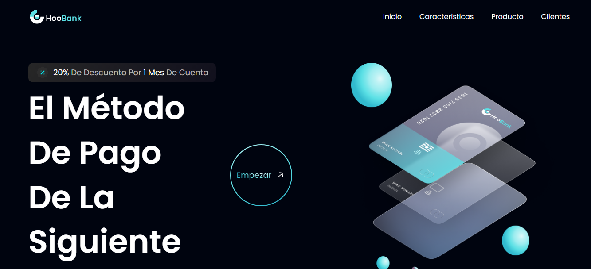

# Bank Modern App

## Descripción

Código Base De La Interfaz Del Proyecto Bank Modern App Hecha En React.js Y Tailwindcss En Fase De Desarrollo.

---

## Vista En Versión Desktop

## Vista En Versión Mobile

## Enlace De La Página

[Bank Modern App](https://bank-modern-app-two.vercel.app/)

---

## Comandos

- npm run dev
- npm run build
- npm run preview

---

## Dependencias De Desarrollo

- autoprefixer
- postcss
- tailwindcss
